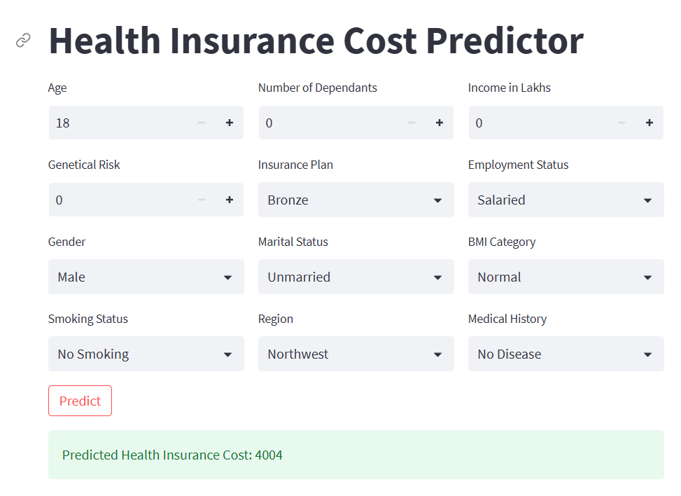

<p align="center">
  <a href="https://predict-insurance-premium.streamlit.app/" target="_blank">
    
  </a>
</p>

# Predictive Health Insurance Premium Model

A predictive machine learning solution developed for **Shield Insurance** by **AtliQ AI**. This project aims to estimate health insurance premiums based on applicant data such as age, BMI, smoking status, and medical history.

<p align="center">
  
</p>


## 📌 Project Overview

Shield Insurance seeks to enhance its underwriting process by integrating a predictive system that estimates premiums accurately and quickly. This project was executed in two phases:

- **Phase 1 (MVP)**: Build a high-accuracy machine learning model and deploy it via an interactive web application.
- **Phase 2**: Plan for future infrastructure to enable straight-through processing (STP) for quote automation (not covered in this repo).


## 🧠 Features

- Predicts health insurance premiums with >97% accuracy.
- Streamlit web application for real-time prediction input and output.
- Cloud deployment to ensure availability and scalability.
- Documentation and training support for underwriters.


## 🚀 Getting Started

### 1. Clone the Repository

```
git clone https://github.com/lintosunny/insurance-premium-estimator.git
```

### 2. Create environment
```
conda create -n venv python=3.10
conda activate venv
```

### 3. Install Dependencies
```
pip install -r requirements.txt
```

### 4. Run Streamlit App
```
streamlit run main.py
```


## 📊 Model Development Workflow

### Data Collection & Cleaning
- Collected labeled data with target premium values.
- Cleaned and explored the data through EDA.

### Model Training
- Multiple algorithms were evaluated (e.g., Linear Regression, XGBoost).
- Final model selected based on MAPE and R² score.

### Deployment
- Trained model serialized using `joblib`.
- Deployed on a secure cloud server with REST API endpoints.

### Web App
- Developed an intuitive Streamlit UI for underwriters.
- Includes input form and real-time premium prediction.


## ✅ Acceptance Criteria (Phase 1)

- Model accuracy ≥ 97%
- 95% of predictions within ±10% error margin
- Web app fully functional and usable remotely
- Model and app deployed securely on the cloud
